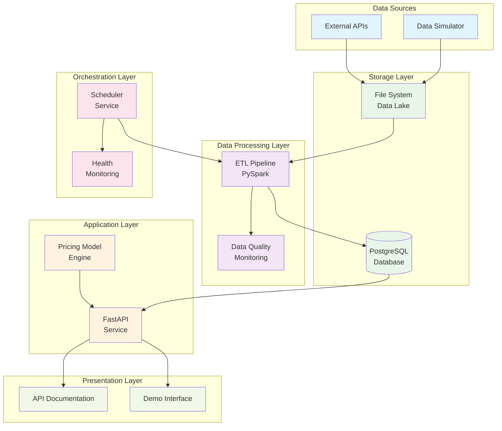

# 🏗️ NOVA Bus Pricing Pipeline - System Architecture

## 📋 Executive Summary

The NOVA Bus Pricing Pipeline is a comprehensive data engineering solution that processes bus schedule and occupancy data to provide dynamic pricing recommendations. Built with modern microservices architecture, it demonstrates production-ready capabilities in data processing, real-time analytics, and automated operations.

## 🎯 Business Problem

**Transportation operators need intelligent pricing strategies** to maximize revenue while maintaining customer satisfaction. Traditional fixed pricing models fail to account for:

- **Dynamic demand patterns** (peak vs off-peak hours)
- **Route popularity variations** (high-demand vs underutilized routes)
- **Real-time occupancy levels** (supply-demand balance)
- **Competitive market conditions** (seasonal variations, events)

**Solution**: An automated pipeline that analyzes historical patterns and current conditions to suggest optimal pricing in real-time.

## 🏛️ High-Level Architecture



## 🔧 Component Architecture

### 1. **Data Simulator Service** 🎲

**Purpose**: Generate realistic bus schedule and occupancy data for testing and development.

**Technology Stack**:

- Python 3.9+ with pandas for data manipulation
- JSON output format for standardized data exchange
- Configurable parameters for various test scenarios

**Key Features**:

- Multiple Indian routes (Mumbai-Pune, Delhi-Agra, etc.)
- Various bus operators and seat types
- Realistic fare structures and occupancy patterns
- Intentional anomalies for data quality testing

**Data Schema**:

```json
{
  "schedules": [...],
  "occupancy_records": [...],
  "metadata": {
    "routes": [...],
    "operators": [...]
  }
}
```

### 2. **ETL Pipeline Service** ⚙️

**Purpose**: Extract, transform, and load bus data with comprehensive quality assurance.

**Technology Stack**:

- Apache Spark (PySpark) for distributed processing
- PostgreSQL JDBC driver for database connectivity
- pandas for data manipulation and validation

**Architecture Pattern**: Extract → Transform → Load (ETL)

**Processing Stages**:

1. **Extraction**: Read JSON files with schema validation
2. **Transformation**:
   - Data cleaning and normalization
   - Anomaly detection and correction
   - Business rule validation
3. **Loading**: Batch insert into PostgreSQL with constraints

**Data Quality Framework**:

- **Validation Rules**: Fare ranges, occupancy constraints, timestamp validation
- **Anomaly Detection**: Statistical outliers, impossible values
- **Quality Metrics**: Completeness, accuracy, consistency scores
- **Issue Tracking**: Categorized quality problems with remediation

### 3. **Database Layer** 🗄️

**Purpose**: Centralized data storage with optimized performance and data integrity.

**Technology Stack**:

- PostgreSQL 15 with advanced features
- Optimized indexing strategy
- Stored procedures for complex analytics

**Schema Design**:

```sql
-- Core Tables
routes (route_id, origin, destination, distance_km)
operators (operator_id, name, contact_email, is_active)
schedules (schedule_id, route_id, operator_id, departure_time, arrival_time)
seat_occupancy (schedule_id, seat_type, total_seats, occupied_seats, fare, occupancy_rate)

-- Quality & Analytics
data_quality_log (issue_type, description, timestamp, record_id)
pricing_model_results (schedule_id, suggested_fare, confidence_score, reasoning)
```

**Performance Optimizations**:

- **Composite Indexes**: Multi-column indexes for common query patterns
- **Partitioning**: Date-based partitioning for large datasets
- **Materialized Views**: Pre-computed aggregations
- **Query Optimization**: Execution plan analysis and tuning

### 4. **FastAPI Service** 🚀

**Purpose**: RESTful API providing analytics, pricing suggestions, and system management.

**Technology Stack**:

- FastAPI with automatic OpenAPI documentation
- SQLAlchemy ORM for database operations
- Pydantic for request/response validation
- Uvicorn ASGI server for production deployment

**API Architecture**:

```
├── Health & Status
│   ├── GET /health
│   └── GET /stats/summary
├── Core Resources
│   ├── GET /routes
│   ├── GET /operators
│   └── GET /schedules
├── Analytics
│   ├── GET /analytics/occupancy
│   └── GET /analytics/route/{route_id}
├── Pricing Engine
│   ├── POST /pricing/suggest
│   └── GET /pricing/history
├── Data Quality
│   ├── GET /data-quality/report
│   └── GET /data-quality/issues
└── Administration
    ├── POST /admin/etl/trigger
    └── GET /admin/etl/history
```

**Design Patterns**:

- **Repository Pattern**: Data access abstraction
- **Dependency Injection**: Service layer separation
- **Error Handling**: Consistent HTTP status codes and error messages
- **Validation**: Input/output schema validation with Pydantic

### 5. **Pricing Model Engine** 💰

**Purpose**: Intelligent fare optimization using heuristic algorithms.

**Algorithm Architecture**:

```python
class HeuristicPricingModel:
    def suggest_pricing(params):
        base_fare = calculate_base_fare(distance, seat_type)

        # Multi-factor adjustments
        occupancy_adj = get_occupancy_adjustment(occupancy_rate)
        time_adj = get_time_adjustment(departure_time)
        route_adj = get_route_adjustment(distance, seat_type)

        # Apply business constraints
        suggested_fare = apply_constraints(
            base_fare * occupancy_adj * time_adj * route_adj
        )

        return {
            "suggested_fare": suggested_fare,
            "confidence_score": calculate_confidence(historical_data),
            "reasoning": generate_explanation(adjustments)
        }
```

**Pricing Factors**:

- **Occupancy Rate**: Higher occupancy → Higher prices
- **Time of Day**: Peak hours → Premium pricing
- **Route Distance**: Distance-based fare structure
- **Seat Type**: Premium/sleeper seat multipliers
- **Booking Timing**: Last-minute vs early booking adjustments

**Business Rules**:

- Fare range: 70% - 250% of base fare
- Minimum confidence threshold for automated pricing
- Rounding to nearest ₹5 for customer-friendly pricing

### 6. **Scheduler Service** ⏰

**Purpose**: Automated orchestration of data pipeline jobs and system monitoring.

**Technology Stack**:

- APScheduler for robust job scheduling
- Health monitoring with configurable intervals
- System maintenance automation

**Job Schedule Architecture**:

```python
# Automated Jobs
ETL_PROCESSING = IntervalTrigger(seconds=300)      # Every 5 minutes
DATA_SIMULATION = IntervalTrigger(minutes=30)      # Every 30 minutes
HEALTH_CHECKS = IntervalTrigger(minutes=5)         # Every 5 minutes
FILE_CLEANUP = CronTrigger(hour=2, minute=0)       # Daily at 2 AM
FRESHNESS_REPORT = IntervalTrigger(hours=4)        # Every 4 hours
```

**Monitoring Capabilities**:

- **Database Health**: Connection and query performance
- **API Health**: Endpoint availability and response times
- **ETL Job Status**: Success/failure tracking with retry logic
- **Data Freshness**: Monitoring data pipeline latency
- **System Resources**: Memory, CPU, and disk usage

## 🔄 Data Flow Architecture

### **Primary Data Flow**

```
Raw Data Generation → ETL Processing → Database Storage → API Serving → Client Consumption
```

**Detailed Flow**:

1. **Data Simulator** generates realistic bus data in JSON format
2. **ETL Pipeline** processes files with validation and quality checks
3. **PostgreSQL** stores cleaned data with referential integrity
4. **FastAPI** serves data through RESTful endpoints
5. **Clients** consume analytics and pricing recommendations

### **Quality Assurance Flow**

```
Data Ingestion → Validation → Quality Metrics → Issue Logging → Alerting
```

### **Pricing Flow**

```
Request → Data Retrieval → Algorithm Execution → Business Rules → Response
```

## 🔒 Security Architecture

### **Data Security**

- **Database Security**: Role-based access control, connection pooling
- **API Security**: Input validation, rate limiting, CORS configuration
- **Container Security**: Non-root user execution, minimal attack surface

### **Operational Security**

- **Environment Variables**: Secure configuration management
- **Logging**: Audit trails without sensitive data exposure
- **Health Checks**: Monitoring without exposing internal details

## 📈 Scalability Architecture

### **Horizontal Scalability**

- **API Service**: Stateless design enables load balancing
- **ETL Processing**: PySpark cluster deployment for large datasets
- **Database**: Read replicas and connection pooling

### **Vertical Scalability**

- **Resource Limits**: Configurable CPU and memory allocation
- **Connection Pooling**: Efficient database connection management
- **Caching Strategy**: Redis integration for frequently accessed data

### **Performance Optimization**

- **Database Indexing**: Optimized for query patterns
- **Data Partitioning**: Time-based partitioning for large tables
- **Async Processing**: Non-blocking I/O operations
- **Resource Monitoring**: Proactive performance management

## 🐳 Deployment Architecture

### **Containerization Strategy**

```yaml
# Multi-service Docker Compose
services:
  - database: PostgreSQL with persistent volumes
  - api: FastAPI with health checks
  - etl: PySpark with resource limits
  - scheduler: APScheduler with monitoring
  - data_simulator: On-demand data generation
```

### **Environment Management**

- **Development**: Local Docker Compose with hot reload
- **Testing**: Isolated containers with test databases
- **Production**: Kubernetes deployment with auto-scaling

### **CI/CD Pipeline**

```yaml
# GitHub Actions Workflow
- Code Quality: Linting, formatting, security scanning
- Testing: Unit tests, integration tests, API tests
- Building: Docker image creation and tagging
- Deployment: Automated staging and production deployment
```

## 🎯 Architecture Benefits

### **Developer Experience**

- **One-Command Setup**: `make quickstart` for complete environment
- **Interactive Documentation**: Auto-generated API docs with testing
- **Comprehensive Testing**: Unit, integration, and end-to-end tests
- **Clear Separation**: Microservices with well-defined boundaries

### **Operational Excellence**

- **Monitoring**: Health checks and performance metrics
- **Automation**: Scheduled jobs and maintenance tasks
- **Reliability**: Error handling and recovery mechanisms
- **Scalability**: Designed for growth and high availability

### **Business Value**

- **Dynamic Pricing**: Revenue optimization through intelligent algorithms
- **Data Quality**: Reliable analytics through comprehensive validation
- **Real-time Operations**: Low-latency pricing and analytics
- **Cost Efficiency**: Optimized resource utilization and automation

## 🔮 Future Architecture Evolution

### **Phase 4 Enhancements** (Future Development)

- **Machine Learning**: Advanced pricing models with ML algorithms
- **Real-time Streaming**: Apache Kafka for real-time data processing
- **Advanced Analytics**: Time series forecasting and demand prediction
- **Mobile Integration**: REST API for mobile applications
- **Multi-tenancy**: Support for multiple transportation operators

### **Cloud Migration Strategy**

- **AWS Deployment**: ECS/EKS for container orchestration
- **Managed Services**: RDS, ElastiCache, S3 integration
- **Monitoring**: CloudWatch, Prometheus, Grafana
- **Auto-scaling**: Dynamic resource allocation based on demand

---

**🏗️ This architecture demonstrates production-ready design principles** suitable for transportation analytics, dynamic pricing, and large-scale data processing applications.
